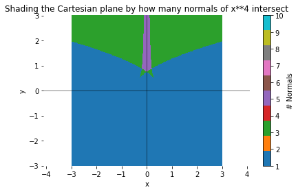

# Normal-Intersections-Mathematics
A visualiser I created when I was working on a very interesting, self-created mathematics problem.

The problem was roughly something like this: 'For any given point in the cartesian plane, find a rule which dictates the number of normals to the curve $y=x^2$ that intersect that point'.

The problem is very nice and only requires elementary methods in calculus, such as differentiation and the understanding of normals.

After solving this problem I came to the answer of a line which separated the cartesian plane into two sections, the region above the line contained all points with 3 normals that intersect, the region below contained all points which had 1 normal, and on the line itself had points which had 2 normals (or 1 normal, and 2 'repeated' normals. That line is shown below.

## $y=\frac{3x^23}{2\sqrt[3]{2}}+\frac{1}{2}$

As a mathematician, I was intrigued to generalize my solution to work with other polynomials and maybe some transcendental curves. However, I quickly realised this would be very difficult as it would require solving equations only possible through numerical methods, such as some polynomials with degrees n, where n > 4.

I then decided that it would be interesting to visualise these areas via numerical and computational methods. 

Here are a few. (There are more beautiful ones, but I will leave them to you to find)

## Normal intersections for $y=x^2$

## Normal intersections for $y=x^4$

## Normal intersections for $y=x^4-4x^2$

## Normal intersections for $y=x^5-x^3$

## BONUS: $y=\frac{1}{x}$, this one is not possible using the code as it is. 
However it is not hard to change the code in order to make it work. I'll leave it as a challenge

(All plots were generated using DETAIL=400, took my Macbook Air about a minute to produce each one on Jupyter Notebook)
